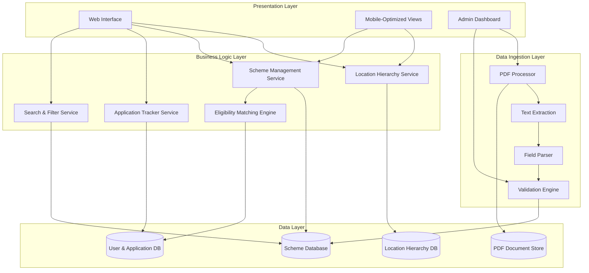
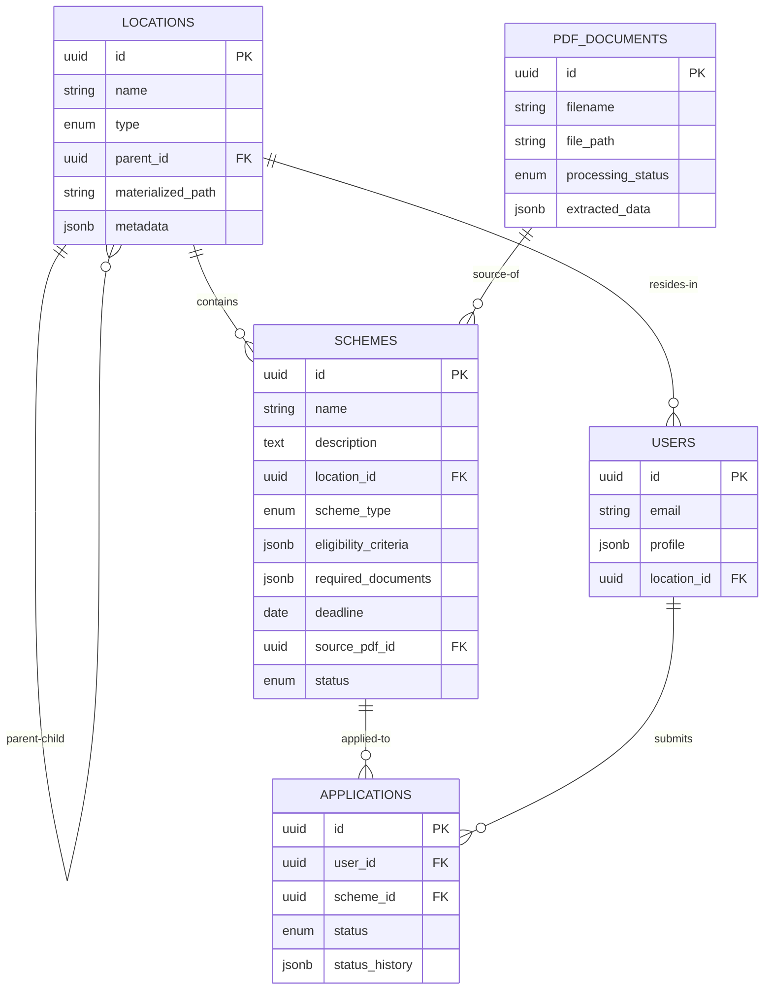

# Design Document: Sonnet - Smart Scheme & Job Informer

## Overview

Sonnet is a location-first scholarship and job discovery system designed for students in rural districts. The system architecture consists of three main layers:

1. **Data Ingestion Layer**: Processes PDF documents to extract scheme information
2. **Core Business Logic Layer**: Manages hierarchical location data, eligibility matching, and application tracking
3. **Presentation Layer**: Provides accessible, mobile-friendly interfaces optimized for low-bandwidth environments

The system prioritizes simplicity, accessibility, and offline-first capabilities to serve users with limited connectivity.

## Architecture

### High-Level Architecture



### Design Principles

1. **Location-First Navigation**: The primary navigation paradigm follows geographic hierarchy
2. **Offline-First**: Cache aggressively to support intermittent connectivity
3. **Progressive Enhancement**: Core functionality works without JavaScript
4. **Mobile-First**: Design for small screens and touch interfaces
5. **Accessibility**: WCAG 2.1 AA compliance with focus on screen reader support

## Components and Interfaces

### 1. Location Hierarchy Service

Manages the hierarchical organization of geographic locations and their relationships.

**Data Structure:**
```
Location {
  id: string
  name: string
  type: LocationType  // COUNTRY, STATE, DISTRICT
  parent_id: string | null
  metadata: {
    population: number
    language_codes: string[]
  }
}

LocationType = COUNTRY | STATE | DISTRICT
```

**Key Operations:**
- `getChildren(locationId: string) -> Location[]`: Returns immediate child locations
- `getAncestors(locationId: string) -> Location[]`: Returns path from root to location
- `getSchemes(locationId: string) -> Scheme[]`: Returns schemes available at this location
- `searchLocations(query: string) -> Location[]`: Fuzzy search for locations by name

**Implementation Notes:**
- Use adjacency list model for efficient parent-child queries
- Maintain materialized path for fast ancestor queries
- Index location names for search performance

### 2. PDF Processor

Handles PDF document ingestion and coordinates extraction pipeline.

**Processing Pipeline:**
```
PDF Upload → Text Extraction → Structure Analysis → Field Parsing → Validation → Storage
```

**Key Operations:**
- `ingestPDF(file: PDFFile, metadata: SchemeMetadata) -> ProcessingJob`: Initiates processing
- `getProcessingStatus(jobId: string) -> JobStatus`: Returns current processing state
- `getExtractionResults(jobId: string) -> ExtractedScheme`: Returns parsed scheme data

**Text Extraction Strategy:**
- Use PDF text extraction library (e.g., PyPDF2, pdf.js, or Apache PDFBox)
- Preserve layout information (bounding boxes, reading order)
- Handle multi-column layouts and tables
- Extract text in logical reading order

**Field Parsing Strategy:**
- Use pattern matching and keyword detection for field identification
- Look for section headers: "Eligibility", "Required Documents", "Deadline", "How to Apply"
- Extract structured data using regular expressions and NLP techniques
- Assign confidence scores to extracted fields

**Confidence Scoring:**
```
ConfidenceLevel = HIGH (>0.8) | MEDIUM (0.5-0.8) | LOW (<0.5)

ExtractedField {
  field_name: string
  value: string
  confidence: number
  source_location: BoundingBox
  requires_review: boolean
}
```

### 3. Scheme Management Service

Manages scheme data, including CRUD operations and scheme lifecycle.

**Data Structure:**
```
Scheme {
  id: string
  name: string
  description: string
  location_id: string
  scheme_type: SchemeType  // SCHOLARSHIP, GRANT, JOB, INTERNSHIP
  eligibility_criteria: EligibilityCriteria
  required_documents: Document[]
  deadline: Date | null
  application_url: string | null
  source_pdf_id: string
  status: SchemeStatus  // ACTIVE, CLOSED, DRAFT
  created_at: Date
  updated_at: Date
}

EligibilityCriteria {
  age_min: number | null
  age_max: number | null
  education_level: EducationLevel[]
  income_max: number | null
  gender: Gender | null
  location_restrictions: string[]
  other_criteria: string[]
}

Document {
  name: string
  description: string
  is_mandatory: boolean
}

SchemeType = SCHOLARSHIP | GRANT | JOB | INTERNSHIP
SchemeStatus = ACTIVE | CLOSED | DRAFT
EducationLevel = PRIMARY | SECONDARY | HIGHER_SECONDARY | UNDERGRADUATE | POSTGRADUATE
Gender = MALE | FEMALE | OTHER | ANY
```

**Key Operations:**
- `createScheme(scheme: Scheme) -> string`: Creates new scheme, returns ID
- `updateScheme(id: string, updates: Partial<Scheme>) -> void`: Updates scheme fields
- `getScheme(id: string) -> Scheme`: Retrieves scheme by ID
- `listSchemes(filters: SchemeFilters) -> Scheme[]`: Returns filtered schemes
- `deleteScheme(id: string) -> void`: Soft deletes scheme

### 4. Eligibility Matching Engine

Compares user profiles against scheme eligibility criteria to compute match scores.

**User Profile Structure:**
```
UserProfile {
  user_id: string
  age: number
  gender: Gender
  location_id: string
  education_level: EducationLevel
  family_income: number
  additional_info: Map<string, any>
}
```

**Matching Algorithm:**
```
computeMatchScore(profile: UserProfile, criteria: EligibilityCriteria) -> MatchResult {
  score = 0
  max_score = 0
  failed_criteria = []
  
  // Age check
  if criteria.age_min or criteria.age_max:
    max_score += 1
    if criteria.age_min <= profile.age <= criteria.age_max:
      score += 1
    else:
      failed_criteria.append("age")
  
  // Education check
  if criteria.education_level:
    max_score += 1
    if profile.education_level in criteria.education_level:
      score += 1
    else:
      failed_criteria.append("education")
  
  // Income check
  if criteria.income_max:
    max_score += 1
    if profile.family_income <= criteria.income_max:
      score += 1
    else:
      failed_criteria.append("income")
  
  // Gender check
  if criteria.gender and criteria.gender != ANY:
    max_score += 1
    if profile.gender == criteria.gender:
      score += 1
    else:
      failed_criteria.append("gender")
  
  // Location check
  if criteria.location_restrictions:
    max_score += 1
    if profile.location_id in criteria.location_restrictions:
      score += 1
    else:
      failed_criteria.append("location")
  
  match_percentage = (score / max_score) * 100 if max_score > 0 else 100
  is_eligible = (failed_criteria.length == 0)
  
  return MatchResult(match_percentage, is_eligible, failed_criteria)
}

MatchResult {
  match_percentage: number
  is_eligible: boolean
  failed_criteria: string[]
}
```

**Key Operations:**
- `matchUser(userId: string, schemeId: string) -> MatchResult`: Computes match for single scheme
- `findMatchingSchemes(userId: string, filters: SchemeFilters) -> RankedScheme[]`: Returns schemes ranked by match score
- `explainMatch(userId: string, schemeId: string) -> MatchExplanation`: Provides detailed match breakdown

### 5. Application Tracker Service

Manages user application records and status tracking.

**Data Structure:**
```
Application {
  id: string
  user_id: string
  scheme_id: string
  status: ApplicationStatus
  status_history: StatusChange[]
  notes: string
  created_at: Date
  updated_at: Date
}

ApplicationStatus = INTERESTED | IN_PROGRESS | SUBMITTED | UNDER_REVIEW | ACCEPTED | REJECTED

StatusChange {
  from_status: ApplicationStatus | null
  to_status: ApplicationStatus
  timestamp: Date
  notes: string
}
```

**Key Operations:**
- `createApplication(userId: string, schemeId: string) -> string`: Creates application record
- `updateStatus(applicationId: string, newStatus: ApplicationStatus, notes: string) -> void`: Updates status
- `getUserApplications(userId: string) -> Application[]`: Returns all user applications
- `getApplicationsByStatus(userId: string, status: ApplicationStatus) -> Application[]`: Filters by status
- `getApplicationHistory(applicationId: string) -> StatusChange[]`: Returns status timeline

### 6. Search and Filter Service

Provides full-text search and multi-criteria filtering for schemes.

**Search Strategy:**
- Index scheme name, description, and eligibility criteria text
- Use fuzzy matching for typo tolerance
- Support phrase queries and boolean operators
- Rank results by relevance score

**Filter Dimensions:**
```
SchemeFilters {
  location_ids: string[]
  scheme_types: SchemeType[]
  education_levels: EducationLevel[]
  deadline_before: Date | null
  deadline_after: Date | null
  income_max: number | null
  only_eligible: boolean  // Filter to user's eligible schemes
  text_query: string | null
}
```

**Key Operations:**
- `search(query: string, filters: SchemeFilters) -> SearchResult[]`: Full-text search with filters
- `filter(filters: SchemeFilters) -> Scheme[]`: Filter without text search
- `getSuggestions(partial: string) -> string[]`: Autocomplete suggestions

## Data Models

### Database Schema

**locations table:**
```
id: UUID PRIMARY KEY
name: VARCHAR(255) NOT NULL
type: ENUM('COUNTRY', 'STATE', 'DISTRICT') NOT NULL
parent_id: UUID REFERENCES locations(id)
materialized_path: VARCHAR(1000)  // e.g., "/country_id/state_id/"
metadata: JSONB
created_at: TIMESTAMP
updated_at: TIMESTAMP

INDEX idx_parent_id ON locations(parent_id)
INDEX idx_materialized_path ON locations(materialized_path)
INDEX idx_name ON locations(name)
```

**schemes table:**
```
id: UUID PRIMARY KEY
name: VARCHAR(500) NOT NULL
description: TEXT
location_id: UUID REFERENCES locations(id) NOT NULL
scheme_type: ENUM('SCHOLARSHIP', 'GRANT', 'JOB', 'INTERNSHIP') NOT NULL
eligibility_criteria: JSONB NOT NULL
required_documents: JSONB NOT NULL
deadline: DATE
application_url: VARCHAR(1000)
source_pdf_id: UUID REFERENCES pdf_documents(id)
status: ENUM('ACTIVE', 'CLOSED', 'DRAFT') NOT NULL
created_at: TIMESTAMP
updated_at: TIMESTAMP

INDEX idx_location_id ON schemes(location_id)
INDEX idx_scheme_type ON schemes(scheme_type)
INDEX idx_deadline ON schemes(deadline)
INDEX idx_status ON schemes(status)
FULLTEXT INDEX idx_search ON schemes(name, description)
```

**users table:**
```
id: UUID PRIMARY KEY
email: VARCHAR(255) UNIQUE
phone: VARCHAR(20)
profile: JSONB  // Contains age, gender, education, income, etc.
location_id: UUID REFERENCES locations(id)
created_at: TIMESTAMP
updated_at: TIMESTAMP

INDEX idx_location_id ON users(location_id)
```

**applications table:**
```
id: UUID PRIMARY KEY
user_id: UUID REFERENCES users(id) NOT NULL
scheme_id: UUID REFERENCES schemes(id) NOT NULL
status: ENUM('INTERESTED', 'IN_PROGRESS', 'SUBMITTED', 'UNDER_REVIEW', 'ACCEPTED', 'REJECTED') NOT NULL
status_history: JSONB NOT NULL
notes: TEXT
created_at: TIMESTAMP
updated_at: TIMESTAMP

INDEX idx_user_id ON applications(user_id)
INDEX idx_scheme_id ON applications(scheme_id)
INDEX idx_status ON applications(status)
UNIQUE INDEX idx_user_scheme ON applications(user_id, scheme_id)
```

**pdf_documents table:**
```
id: UUID PRIMARY KEY
filename: VARCHAR(500) NOT NULL
file_path: VARCHAR(1000) NOT NULL
file_size: BIGINT NOT NULL
mime_type: VARCHAR(100)
processing_status: ENUM('PENDING', 'PROCESSING', 'COMPLETED', 'FAILED') NOT NULL
extracted_data: JSONB
confidence_scores: JSONB
uploaded_by: UUID REFERENCES users(id)
created_at: TIMESTAMP
updated_at: TIMESTAMP

INDEX idx_processing_status ON pdf_documents(processing_status)
```

### Data Relationships




## Correctness Properties

A property is a characteristic or behavior that should hold true across all valid executions of a system—essentially, a formal statement about what the system should do. Properties serve as the bridge between human-readable specifications and machine-verifiable correctness guarantees.

### Property 1: Hierarchical Structure Integrity

*For any* location in the system, the location type must match its position in the hierarchy (countries have no parents, states have country parents, districts have state parents), and the materialized path must correctly represent the path from root to that location.

**Validates: Requirements 1.1**

### Property 2: Parent-Child Relationship Consistency

*For any* location with a parent, calling getChildren on the parent location must include that location in the results, and calling getAncestors on the child must include the parent in the path.

**Validates: Requirements 1.2, 1.3, 1.5**

### Property 3: Location-Scheme Association

*For any* scheme associated with a location, calling getSchemes on that location must return the scheme in the results.

**Validates: Requirements 1.4**

### Property 4: PDF Upload Acceptance

*For any* valid PDF file, the PDF_Processor must accept the upload and return a processing job ID without errors.

**Validates: Requirements 2.1, 2.2**

### Property 5: PDF Upload Error Handling

*For any* invalid file input (non-PDF, corrupted, or unsupported format), the system must return a descriptive error message and not create a processing job.

**Validates: Requirements 2.3**

### Property 6: PDF Storage Round-Trip

*For any* uploaded PDF document, retrieving the stored document by its ID must return a file with identical content to the original upload.

**Validates: Requirements 2.4**

### Property 7: Text Extraction Completeness

*For any* PDF document with extractable text, the extracted text must contain all readable text content from the document in logical reading order.

**Validates: Requirements 2.5**

### Property 8: Scheme Field Population

*For any* successfully processed PDF document, the resulting scheme record must have non-null values for name, description, eligibility_criteria, and required_documents fields.

**Validates: Requirements 3.1, 4.1**

### Property 9: Low-Confidence Field Flagging

*For any* extracted field with a confidence score below 0.5, the field must have requires_review set to true.

**Validates: Requirements 3.5, 4.5**

### Property 10: Application Creation

*For any* user and scheme combination, creating an application must result in a new application record with status "INTERESTED" and the application must be retrievable via getUserApplications.

**Validates: Requirements 5.1**

### Property 11: Application Status Transitions

*For any* valid application status value (INTERESTED, IN_PROGRESS, SUBMITTED, UNDER_REVIEW, ACCEPTED, REJECTED), updating an application to that status must succeed and the new status must be reflected in the application record.

**Validates: Requirements 5.2**

### Property 12: Status History Recording

*For any* application status update, the status_history must contain a new StatusChange entry with the correct from_status, to_status, and a timestamp that is greater than or equal to the previous update timestamp.

**Validates: Requirements 5.3**

### Property 13: Application Data Completeness

*For any* application record, it must contain user_id, scheme_id, status, created_at, and updated_at fields with non-null values.

**Validates: Requirements 5.5**

### Property 14: Search Result Matching

*For any* search query and scheme in the database, if the scheme's name, description, or eligibility criteria contains the query text (case-insensitive), then the scheme must appear in the search results.

**Validates: Requirements 6.2**

### Property 15: Multi-Filter Conjunction

*For any* set of filters applied to scheme search, all returned schemes must satisfy every filter condition (AND logic, not OR).

**Validates: Requirements 6.4**

### Property 16: Search Result Completeness

*For any* scheme in search results, the result object must include name, location_id, and deadline fields.

**Validates: Requirements 6.5**

### Property 17: Offline Data Access

*For any* scheme that has been accessed while online, the scheme data must be retrievable from cache when the system is offline.

**Validates: Requirements 7.3, 7.4**

### Property 18: Deadline Extraction

*For any* successfully processed PDF document containing a deadline, the resulting scheme record must have a non-null deadline field.

**Validates: Requirements 8.1**

### Property 19: Approaching Deadline Detection

*For any* scheme with a deadline within 7 days from the current date, the scheme must be marked with an approaching_deadline flag or similar indicator.

**Validates: Requirements 8.3**

### Property 20: Deadline Sorting

*For any* list of schemes sorted by deadline, each scheme's deadline must be less than or equal to the next scheme's deadline (ascending order).

**Validates: Requirements 8.4**

### Property 21: Expired Scheme Status

*For any* scheme with a deadline in the past, the scheme status must be set to CLOSED.

**Validates: Requirements 8.5**

### Property 22: Profile Creation Completeness

*For any* user profile created with age, location, education level, and family income, all these fields must be stored and retrievable from the profile.

**Validates: Requirements 9.1**

### Property 23: Eligibility Match Computation

*For any* user profile and scheme, the matching engine must return a MatchResult with a match_percentage between 0 and 100, an is_eligible boolean, and a list of failed_criteria.

**Validates: Requirements 9.2, 9.3**

### Property 24: Eligible Scheme Prioritization

*For any* list of schemes returned for a user, schemes where is_eligible is true must appear before schemes where is_eligible is false.

**Validates: Requirements 9.4**

### Property 25: Profile Update Persistence

*For any* user profile update, retrieving the profile immediately after the update must reflect all the updated field values.

**Validates: Requirements 9.5**

### Property 26: Admin Edit Persistence

*For any* administrator edit to a scheme field, retrieving the scheme immediately after the edit must reflect the updated value.

**Validates: Requirements 10.3, 10.4**

### Property 27: Audit Log Recording

*For any* administrator change to scheme data, an audit log entry must be created with the admin user ID, changed field, old value, new value, and timestamp.

**Validates: Requirements 10.5**


## Error Handling

### Error Categories

1. **User Input Errors**: Invalid search queries, malformed profile data, invalid status transitions
2. **Data Validation Errors**: Missing required fields, out-of-range values, invalid references
3. **Processing Errors**: PDF parsing failures, extraction timeouts, unsupported file formats
4. **System Errors**: Database connection failures, file system errors, external service unavailability

### Error Handling Strategy

**User Input Errors:**
- Validate all user inputs at the API boundary
- Return HTTP 400 with descriptive error messages
- Provide field-level validation errors for forms
- Suggest corrections when possible (e.g., "Did you mean...?")

**Data Validation Errors:**
- Use database constraints to enforce data integrity
- Validate foreign key references before insertion
- Return HTTP 422 for validation failures
- Log validation errors for monitoring

**Processing Errors:**
- Implement retry logic with exponential backoff for transient failures
- Set timeouts for PDF processing (e.g., 5 minutes per document)
- Store partial extraction results when processing fails mid-way
- Mark processing jobs as FAILED with error details
- Notify administrators of repeated processing failures

**System Errors:**
- Implement circuit breakers for external dependencies
- Use connection pooling with health checks for databases
- Return HTTP 503 for temporary unavailability
- Provide fallback responses using cached data when possible
- Log all system errors with full context for debugging

### Error Response Format

```
ErrorResponse {
  error_code: string
  message: string
  details: Map<string, any>
  timestamp: Date
  request_id: string
}
```

### Graceful Degradation

- **Offline Mode**: Serve cached data when backend is unreachable
- **Partial Results**: Return available data even if some components fail
- **Default Values**: Use sensible defaults when optional data is unavailable
- **Progressive Enhancement**: Core functionality works without JavaScript

## Testing Strategy

### Dual Testing Approach

The system will use both unit testing and property-based testing to ensure comprehensive coverage:

- **Unit tests**: Verify specific examples, edge cases, and error conditions
- **Property tests**: Verify universal properties across all inputs

Both approaches are complementary and necessary. Unit tests catch concrete bugs and validate specific scenarios, while property tests verify general correctness across a wide range of inputs.

### Property-Based Testing

**Framework Selection:**
- For Python: Use Hypothesis
- For TypeScript/JavaScript: Use fast-check
- For Java: Use jqwik or QuickCheck

**Configuration:**
- Each property test must run a minimum of 100 iterations
- Use deterministic random seeds for reproducibility
- Generate realistic test data (valid location hierarchies, realistic dates, etc.)

**Test Tagging:**
Each property-based test must include a comment tag referencing the design document property:

```
// Feature: scholarship-discovery-system, Property 2: Parent-Child Relationship Consistency
```

**Property Test Implementation:**
- Each correctness property must be implemented by a single property-based test
- Tests should generate random valid inputs using the PBT framework's generators
- Assertions should directly verify the property statement
- Failed tests should provide clear counterexamples

### Unit Testing

**Focus Areas:**
- Specific examples demonstrating correct behavior
- Edge cases: empty inputs, boundary values, null handling
- Error conditions: invalid inputs, missing data, constraint violations
- Integration points: API endpoints, database queries, external services

**Coverage Goals:**
- Aim for 80%+ code coverage
- 100% coverage for critical paths (eligibility matching, application tracking)
- Focus on meaningful tests, not just coverage metrics

### Test Organization

```
tests/
  unit/
    location_service_test
    scheme_service_test
    matching_engine_test
    application_tracker_test
    search_service_test
    pdf_processor_test
  property/
    location_hierarchy_properties
    scheme_management_properties
    eligibility_matching_properties
    application_tracking_properties
    search_filter_properties
  integration/
    api_endpoints_test
    database_operations_test
    pdf_processing_pipeline_test
  e2e/
    user_flows_test
```

### Testing Best Practices

1. **Isolation**: Each test should be independent and not rely on other tests
2. **Repeatability**: Tests should produce the same results on every run
3. **Speed**: Unit and property tests should run quickly (< 5 minutes total)
4. **Clarity**: Test names should clearly describe what is being tested
5. **Maintainability**: Avoid brittle tests that break with minor changes

### Continuous Integration

- Run all tests on every commit
- Block merges if tests fail
- Generate coverage reports
- Run property tests with higher iteration counts (1000+) nightly
- Monitor test execution time and flakiness

## Implementation Notes

### Technology Recommendations

**Backend:**
- Language: Python (for PDF processing libraries) or Node.js (for JavaScript ecosystem)
- Framework: FastAPI (Python) or Express (Node.js)
- Database: PostgreSQL (for JSONB support and full-text search)
- PDF Processing: PyPDF2 or pdf-lib
- Search: PostgreSQL full-text search or Elasticsearch for advanced features

**Frontend:**
- Framework: React or Vue.js with server-side rendering for performance
- Mobile: Progressive Web App (PWA) for offline support
- Styling: Tailwind CSS for responsive design
- State Management: React Query or SWR for caching

**Infrastructure:**
- Hosting: Cloud provider with CDN for static assets
- File Storage: Object storage (S3, GCS) for PDF documents
- Caching: Redis for session data and frequently accessed schemes
- Background Jobs: Celery (Python) or Bull (Node.js) for PDF processing

### Performance Considerations

1. **Database Indexing**: Index all foreign keys and frequently queried fields
2. **Query Optimization**: Use materialized paths for efficient hierarchy queries
3. **Caching Strategy**: Cache location hierarchies and popular schemes
4. **Lazy Loading**: Load scheme details only when requested
5. **Pagination**: Limit search results to 20-50 items per page
6. **Image Optimization**: Compress and resize images for mobile devices
7. **Code Splitting**: Load JavaScript bundles on demand

### Security Considerations

1. **Authentication**: Use JWT tokens or session-based auth
2. **Authorization**: Role-based access control (student, admin)
3. **Input Validation**: Sanitize all user inputs to prevent injection attacks
4. **File Upload Security**: Validate file types, scan for malware, limit file sizes
5. **Data Privacy**: Encrypt sensitive user data (income, personal details)
6. **API Rate Limiting**: Prevent abuse with rate limits per user/IP
7. **HTTPS**: Enforce HTTPS for all connections

### Accessibility Considerations

1. **Semantic HTML**: Use proper heading hierarchy and ARIA labels
2. **Keyboard Navigation**: Ensure all functionality is keyboard accessible
3. **Screen Reader Support**: Test with NVDA, JAWS, and VoiceOver
4. **Color Contrast**: Meet WCAG 2.1 AA standards (4.5:1 for normal text)
5. **Focus Indicators**: Visible focus states for all interactive elements
6. **Alternative Text**: Provide alt text for all images and icons
7. **Form Labels**: Associate labels with form inputs
8. **Error Messages**: Announce errors to screen readers

### Localization Considerations

1. **Multi-language Support**: Support regional languages (Hindi, Tamil, Telugu, etc.)
2. **Date Formats**: Use locale-appropriate date formatting
3. **Currency**: Display amounts in local currency (INR)
4. **Right-to-Left**: Support RTL languages if needed
5. **Translation Management**: Use i18n libraries for string management
